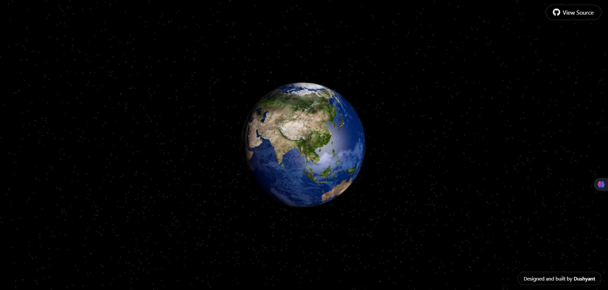

# 🌍 Interactive 3D Earth — Powered by Three.js

A real-time, interactive Earth rendered in 3D using Three.js.  
Features rotating clouds, atmospheric glow, and animated arcs connecting global points.  
Built for clarity, performance, and immersive experience.

---

## 🖼 Preview

---

## 🧠 Why This Exists

To explore the intersection of **design**, **data**, and **WebGL**.  
A minimalist yet powerful way to visualize our planet in motion.

---

## ⚙️ Tech Stack

- 🌐 **Three.js** — 3D engine
- 🌫️ **Custom shaders** — for glow and atmosphere
- 🌀 **Real-time animation** — clouds & rotation
- 🛰️ **Animated arcs** — dynamic connections between global coordinates

---

## 🧭 Features

- Interactive, zoomable globe  
- Smooth Earth rotation with cloud layers  
- Atmospheric glow using shaders  
- Custom global arc animations (from point A to B)  
- Designed for performance and visual impact

---

